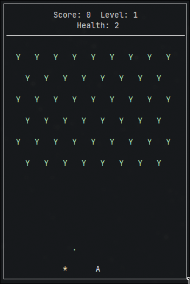

# Space Invaders
_by Henrik Eike Wolff, Lukas Kursitis and Johannes Severin Höping_

&nbsp;  
This project is a implementation of **Space Invaders** in **C++** using **ncurses**.

## How To Play
* Move the Player Character **A** by pressing
  * **A** or the **left arrow key** for moving left
  * **D** or the **right arrow key** for moving right
  * **space bar** to shoot
* Collect PowerUPs for special effects like
  * increasing you health
  * shooting more bullets
* Shoot the alien ships **Y** up your score.  
The value of the alien ships increases per level.
* If you are hit by an enemy bullet, you loose one health.  
* In case your health drops to zero or the aliens reach the bottom of the playing field, it's game over.  
You will have to start all over again.
* De-/Activate the **automation** by pressing **S**

&nbsp;
## Compile and Execute the Game

First make sure you have all required packages installed:  

For Debian based distributions run  
``sudo apt install gcc g++ make libncurses-devel``

For Arch run  
``sudo pacman -S gcc make ncurses``

If all dependencies are installed you can compile and execute the game by running  
``make game && chmod +x ./game && ./game``

To remove all previous compiled files run  
``make clean``

&nbsp;
## Compile and Run Tests

First make sure you have all required packages installed:

For Debian based distributions run  
``sudo apt install libboost-dev``

For Arch run  
``sudo pacman -S boost``

If all dependencies are installed you can compile and execute the game by running  
``make test && chmod +x ./test && ./test``
